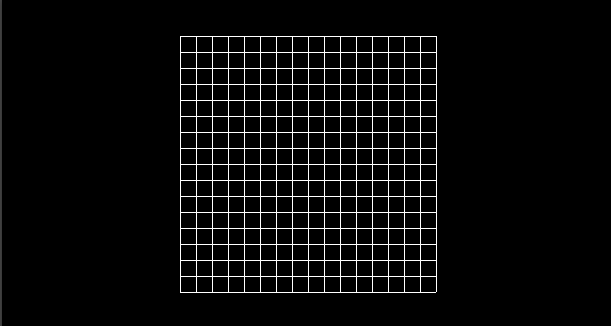
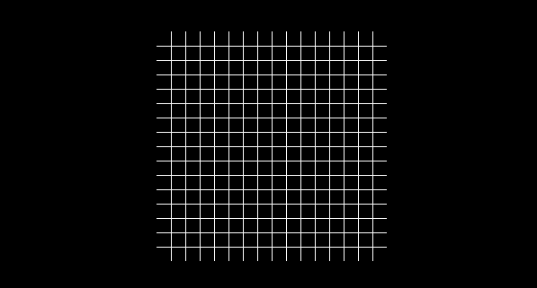
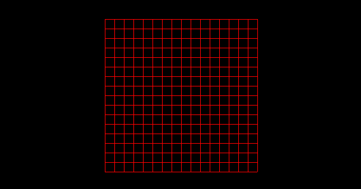

# PIXIJS Grid
## A utility class for drawing grids in PIXIJS.

### Getting Started
You can run `npm install pixijs-grid` or simply clone this repository and use the code from `dist`.

Add `pixijs-grid.js` (from `src/`) to your project directory. 
In your HTML doc:
```html
<script src="path/to/pixijs-grid.js"></script>
```

If you prefer ES Modules, you can import from `path/to/pixijs-grid.mjs`.

### Features
On default, PixiJSGrid simply renders a grid with white lines:
```javascript
const grid = new PixiJSGrid(width).drawGrid();
```


<hr>

You can also render the grid without boundary edges. This is useful if you want to draw
multiple grids next to each other:
```javascript
const grid = new PixiJSGrid(width);
grid.drawBoundaries = false;
grid.drawGrid();
```

 
<hr>

PixiJSGrid extends the `PIXI.Graphics` class, so you can customize several properties of the grid such as *lineStyle*.
```javascript
const grid = new PixiJSGrid(width);
// Color the grid red
grid.lineStyle({ width: 1, color: 0xff0000 });
grid.drawGrid();
```


## API
<hr>

### Methods

#### Constructor
```typescript
  PixiJSGrid(
    width: number,
    cellSize?: number | null = null,
    lineStyle?: {
      width: number,
      color: number,
      alpha: number,
      alignment: number,
      native: boolean
    } = {
      width: 1,
      color: 0xffffff,
      alpha: 1,
      alignment: 0.5,
      native: true,
    },
    useCorrectedWidth?: boolean = true,
    drawBoundaries?: boolean = true
  ): this
```
***Arguments***
- `width: number`. Required. The width of the grid.
  
  **NOTE:** The class calculates a "corrected" width to support the default size of the cells within the grid. If using the default cell size, the grid's width will be corrected to be the **smallest square number** greater than `width`.

- `cellSize?: number`. The size of each cell in the grid. Defaults to `sqrt(width)`.

- `lineStyle?: number`. Configuration for the object's `LineStyle` object, which is inherited from `PIXI.Graphics`. See PIXIJS's documentation for options [here](http://pixijs.download/release/docs/PIXI.Graphics.html#lineStyle).

- `useCorrectedWidth?: boolean`. If false, override the grid's default behaviour, which is to use a corrected width (see the note on the `width` parameter for details) when `cellSize` is `null`.

- `drawBoundaries?: boolean`. If false, the outermost lines of the grid will not be drawn. This is useful if you plan on tiling grids.

#### drawGrid
```typescript
  drawGrid(): this
```
Draws the grid to the containing PIXI stage.

#### clearGrid
```typescript
  clearGrid(retainLineStyle?: boolean = true): this
```
Erases the grid from the screen. Does not remove the grid object from the PIXI stage.

***Arguments***
- `retainLineStyle?: boolean`. If true, keep the grid's line style. Otherwise, the grid's line style will be cleared.

#### getCellCoordinates
```typescript
  getCellCoordinates(x: number, y: number): { x: number, y: number}
```
Converts global `(x, y)` coordinates into grid cell coordinates.

<hr>

### Properties

#### cellSize
```typescript
  get cellSize(): number
  set cellSize(cellSize: number | null)
```

Sets and gets the grid's cell size. If set to `null`, the grid will use the default, which is `Math.sqrt(PixiJSGrid.correctedWidth)`.

#### amtLines
```typescript
  get amtLines(): number
```
Gets the amount of lines to be rendered by the grid. The value is equal to `Math.floor(PixiJSGrid.gridWidth / grid.cellSize)`.

#### bounds
```typescript
 get bounds(): { x1: number, y1: number, x2: number, y2: number } 
```
Gets the leftmost (`x1`), topmost (`y1`), rightmost (`x2`), and bottommost (`y2`) coordinates of the grid in global space.

#### drawBoundaries
```typescript
  get drawBoundaries(): boolean
  set drawBoundaries(drawBoundaries: boolean)
```
Sets and gets whether the grid will draw the outermmost boundaries on a call to `drawGrid()`.

#### gridWidth
```typescript
  get gridWidth(): number
```
Gets the actual width of the grid. If the constructor argument `useCorrectedWidth` is set to `false`, it will always return the value given to the `width` constructor argument.

Otherwise, if the `cellSize` is at its default value, it will return `PixiJSGrid.correctedWidth`.

#### originalWidth
```typescript
 get originalWidth(): number
```
Gets the value given to the `width` constructor argument.

#### correctedWidth
```typescript
  get correctedWidth(): number
```
Gets the smallest square number greater than `PixiJSGrid.originalWidth`. More specifically this is calculated by computing `Math.ceil(Math.sqrt(this._gridWidth)) ** 2`.

#### onMouseMove
```typescript
  onMouseMove(evt: PIXI.InteractionData, gridCoords: { x: number, y: number }): void
```
Set this function to handle onMouse move events.